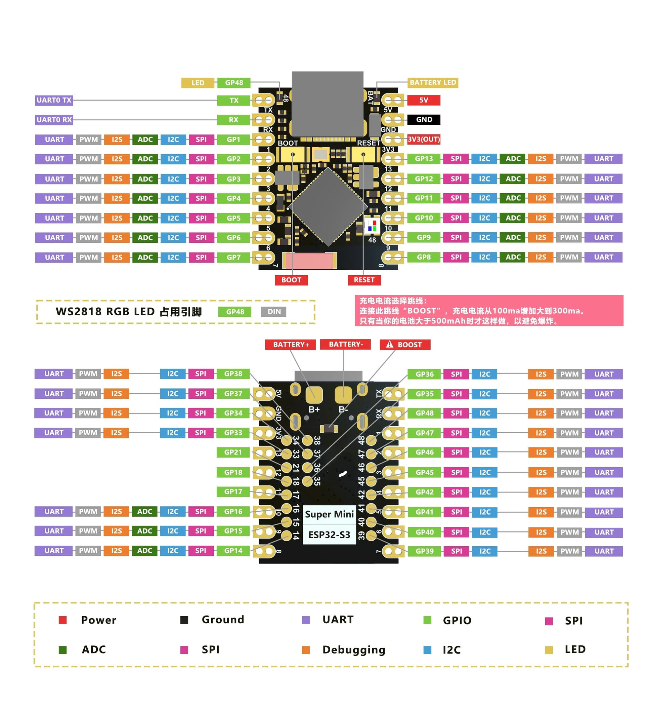

# ☀️ Advanced Synchronized Dual-Axis Solar Tracker & Distributed WSN Node

A production-grade, highly scalable C++ firmware architecture for distributed Wireless Sensor Networks (WSN) deployed on edge-computing hardware.

[](https://www.espressif.com/en/products/socs/esp32-s3)
[](https://www.arduino.cc/)
[](https://docs.espressif.com/projects/esp-idf/en/latest/esp32/api-reference/network/esp_now.html)
[]()
[](https://opensource.org/licenses/MIT)

---

## 📖 System Abstract
This repository implements an enterprise-grade **Dual-Axis Solar Tracker and Atmospheric Monitoring Node** designed around the **ESP32-S3 Supermini** form factor. Moving beyond traditional, isolated tracking configurations, this system enables a decentralized **Wireless Sensor Network (WSN)** capable of cooperative estimation across multiple nodes. 

Through a peer-to-peer, low-overhead **ESP-NOW** mesh backbone, nodes execute real-time orientation synchronization and distributed telemetry aggregation. This structure mitigates localized shading, physical obstructions, and individual sensory anomalies by allowing the cluster to align with the most efficient harvesting node dynamically.

### 🌟 Key Enhancements & Features
* **Decoupled Architecture:** Follows strict Object-Oriented Design and the **Open-Closed Principle**. Hardware drivers, telemetry routing, timekeeping, and networking layers exist as strictly isolated subsystems.
* **Deterministic Event Scheduling:** 100% asynchronous tracking, sampling, and reporting engine built on lightweight `SoftTimer` delta-time tracking—eliminating processor blocking and `delay()` calls.
* **Dynamic Peer Auto-Discovery:** No hardcoded MAC address tables. Nodes utilize hardware-based registers to assign dynamic IDs and apply packet sniffing to learn and register peer nodes on the fly.
* **Precision Energy Analytics:** High-side power tracking via a dedicated I2C INA226 monitor tracking exact micro-level Solar Input Voltage, Current draw, and net Power Generation.
* **Multi-Stage Critical Safety Latches:** Integrated hardware-software safety boundaries mapping LiPo voltage states through an analog attenuation matrix to automatically isolate mechanical components during low-power events.
* **Zero-Drift Kinematics:** Active-duty cycle servo actuation that immediately detaches PWM control lines post-maneuver to eradicate micro-vibration, minimize mechanical gear wear, and completely kill holding current overhead.

---

## 📐 System Topology & Data Flow

The edge node utilizes a highly efficient multi-layered execution plan. Hardware interactions are isolated behind abstraction boundaries, allowing the telemetry routing engine to independently evaluate environmental states before allowing the system controller to settle on motor trajectories.

```
                    +---------------------------------------+
                    |        Environmental Sensors          |
                    |   (LDR Matrix, INA226, BME280, RTC)   |
                    +-------------------+-------------------+
                                        |
                                        v (Asynchronous Polling)
                    +-------------------+-------------------+
                    |           SensorManager               |
                    |    (Data Buffering & Formatting)      |
                    +-------------------+-------------------+
                                        |
                                        v (State Reference)
+-------------------+       +-----------+-----------+       +-------------------+
|  TrackerNetManager|       |   TrackerController   |       |   ManagedServo    |
| (ESP-NOW Routing) |<=====>|  (Decision Engine)    |======>|  (Kinetic Output) |
+-------------------+       +-----------------------+       +-------------------+
```

---

## ⚡ Hardware Realization & Verified Pinouts

> **⚠️ CRITICAL HARDWARE SPECIFICATION:** This deployment is optimized strictly for the **ESP32-S3 Supermini Edge Headers** where all assignments remain bound below **GPIO 13**. To minimize electromagnetic cross-coupling and maintain clear tracing, the infrastructure segregates analog input sensors and the I2C bus down the Left Rail, while routing mechanical PWM control and high-speed clock timing lines down the Right Rail.
> 

### Ultra-Low Pin Count Master Allocation Ledger (≤ GPIO 13)

| Subsystem Target Component | Physical Pin Role / Context | Native Hardware GPIO | Silk-Screen Pin Label | Physical Board Location | Expected Signal Vector |
| :--- | :--- | :--- | :--- | :--- | :--- |
| **Top-Left LDR** | Analog Matrix Coordinate | **GPIO 1** | `GP1` | Left Rail, Pin 3 | 12-Bit Analog Input |
| **Top-Right LDR** | Analog Matrix Coordinate | **GPIO 2** | `GP2` | Left Rail, Pin 4 | 12-Bit Analog Input |
| **Bottom-Left LDR** | Analog Matrix Coordinate | **GPIO 3** | `GP3` | Left Rail, Pin 5 | 12-Bit Analog Input |
| **Bottom-Right LDR** | Analog Matrix Coordinate | **GPIO 4** | `GP4` | Left Rail, Pin 6 | 12-Bit Analog Input |
| **LiPo Power Monitoring** | 10kΩ/10kΩ Midpoint Voltage | **GPIO 5** | `GP5` | Left Rail, Pin 7 | 12-Bit Attenuated Input |
| **Shared Sensor Bus** | SDA (Serial Data Line) | **GPIO 6** | `GP6` | Left Rail, Pin 8 | Synchronous Open-Drain |
| **Shared Sensor Bus** | SCL (Serial Clock Line) | **GPIO 7** | `GP7` | Left Rail, Pin 9 | Synchronous Clock Pulse |
| **Pan Servo Motor** | PWM Actuational Control | **GPIO 8** | `GP8` | Right Rail, Pin 9 | 50Hz Pulse Train |
| **Tilt Servo Motor** | PWM Actuational Control | **GPIO 9** | `GP9` | Right Rail, Pin 8 | 50Hz Pulse Train |
| *System Expansion* | Reserved / Unassigned | *GPIO 10* | *GP10* | Right Rail, Pin 7 | High-Z State |
| **DS1302 Real-Time Clock**| RST / Chip Select | **GPIO 11** | `GP11` | Right Rail, Pin 6 | Logic High Latch |
| **DS1302 Real-Time Clock**| I/O (Serial Data Line) | **GPIO 12** | `GP12` | Right Rail, Pin 5 | Bi-Directional Stream |
| **DS1302 Real-Time Clock**| SCLK (Serial Clock) | **GPIO 13** | `GP13` | Right Rail, Pin 4 | Timing Clock Pulse |

---

## 🔋 Power Management & Safety Architecture

To guarantee long-term operational survival in remote field environments, the power architecture relies on a decoupled, dual-rail distribution matrix. High-current inductive loads (servos) are isolated from high-precision instrumentation circuits to prevent voltage sags from generating calculation drift.

### 1. High-Side Isolation Tracking
The solar panel energy pathway is routed through an **INA226 Bi-Directional Current/Power Monitor** before interfacing with the charging regulators. Ground references are coupled at a single star-point to mitigate ground bounce during mechanical motor acceleration.
* **VBUS Sensor Pin:** Samples true open-circuit/load voltage directly off the panel.
* **Shunt Resistor Bridge:** Configured via a **0.1Ω** metal-foil resistor to monitor charge input with micro-ampere precision.

### 2. Dual-Rail Step-Up Subsystem
* The system uses a high-density **MT3608 DC-DC Boost Converter** connected directly to the lithium storage cells.
* **Pre-Flight Tuning Step:** The MT3608 trim-potentiometer **must** be adjusted to yield an exact output of **5.0V** under a simulated **1.5A** resistive load prior to connecting the MCU board or servo logic inputs. This 5V output drives the ESP32-S3 input rail and delivers independent operating power to the servos.

### 3. Deep Discharge Software Latch
The deployment of typical lithium cells with compact SE9018 charging topologies leaves the storage battery exposed to catastrophic over-discharge since these basic chargers lack integrated protection ICs. 
* A dedicated **10kΩ / 10kΩ (±0.1% tolerance)** resistor divider network steps down the battery's raw voltage to safe analog inputs on **GPIO 5**.
* **The Rule Engine:** If the sampled runtime potential drops below **3.2V** (V_crit), the system invokes an un-interruptible lock state. The `TrackerController` detaches all servo channels to bring holding current down to zero, suspends WSN transmissions, and sleeps until the incoming solar power pushes the battery bank back past a safe threshold (**3.5V** hysteresis).

---

## 🌐 Dynamic Auto-Discovery ESP-NOW Protocol

The networking layer is designed to scale horizontally without manually rewriting firmware or maintaining rigid tracking lists.

### The Dynamic Learning Loop
1. **Universal Interface Initialization:** At boot, every node registers the universal broadcast address `FF:FF:FF:FF:FF:FF` as a permanent communication peer.
2. **Dynamic Peer Extraction:** Rather than maintaining an explicit list of neighbors, every node captures incoming packets using raw callback context parameters:
   ```cpp
   void TrackerNetManager::OnDataRecv(const esp_now_recv_info *recvInfo, const uint8_t *incomingData, int len)
   ```
3. **Automated Peer Insertion:** The runtime checks the sender’s source MAC address (`recvInfo->src_addr`). If that physical address is not found within the local ESP-NOW tracking tables, the node calls `esp_now_add_peer()` to dynamically add it on the fly.
4. **Cooperative Override Engine:** When a node calculates a clear light gradient update, it broadcasts its positional vectors via a unified `SyncPayload`. If a nearby node experiences localized clouding or sensor failures, it drops its local analog loop and passes control directly to the network payload tracking data to maintain alignment with the cluster.

---

## 📂 Codebase Reference & Architecture Directory

The software architecture completely isolates components to make tracking errors easy to trace and test.

### 1. Unified Network Protocol Layer (`NetworkProtocol.h`)
Defines the binary structural boundaries across the wireless space. Packed attributes ensure identical memory alignment across compilers.
```cpp
#pragma once
#include <Arduino.h>

enum PacketType : uint8_t {
    PACKET_PING_DISCOVERY,
    PACKET_TELEMETRY_SHARE,
    PACKET_ACTION_SYNC
};

struct __attribute__((packed)) NetworkHeader {
    uint8_t  sourceID;        
    uint8_t  packetType;      
    uint32_t sequenceNumber;  
};

struct __attribute__((packed)) SyncPayload {
    uint32_t targetEpoch;     
    int16_t  masterPanAngle;  
    int16_t  masterTiltAngle;
};

struct __attribute__((packed)) NetworkPacket {
    NetworkHeader header;
    union {
        SyncPayload syncData;
    } payload;
};
```

### 2. Custom WSN Network Coordinator (`TrackerNetManager.h`)
Manages the non-blocking asynchronous callback hooks and provides local reference registers.
```cpp
#pragma once
#include <Arduino.h>
#include <WiFi.h>
#include <esp_now.h>
#include "NetworkProtocol.h"

class TrackerNetManager {
private:
    uint8_t localNodeID;
    uint32_t seqCounter;
    uint8_t broadcastMac[6] = {0xFF, 0xFF, 0xFF, 0xFF, 0xFF, 0xFF};

    static void OnDataRecv(const esp_now_recv_info *recvInfo, const uint8_t *incomingData, int len);
    bool registerPeer(const uint8_t *mac_addr);

public:
    static TrackerNetManager* instance; 
    bool hasPendingSync;
    SyncPayload latestSyncCommand;

    TrackerNetManager() : localNodeID(0), seqCounter(0), hasPendingSync(false) { instance = this; }
    
    bool begin();
    bool broadcastSync(const SyncPayload &syncData);
    uint8_t getLocalNodeID() const { return localNodeID; }
};
```

---

## 🧠 Automated Machine Learning Expansion Framework

This document delivers the complete, production-ready codebase to transition your edge-tracking WSN mesh into a centralized, predictive AI ecosystem. 

---

## 📂 Section 1: Unified Network Protocol Layer

This shared header file establishes explicit binary layouts for bidirectional communication. It wraps telemetry tracking and central machine learning overrides into packed structures to prevent structural alignment corruption across environments.

### `NetworkProtocol.h`
```cpp
#pragma once
#include <Arduino.h>

enum PacketType : uint8_t {
    PACKET_TELEMETRY,
    PACKET_ML_OVERRIDE
};

struct __attribute__((packed)) TelemetryPayload {
    float busVoltage;
    float currentmA;
    float temperature;
    float humidity;
    float pressure;
    int16_t panAngle;
    int16_t tiltAngle;
};

struct __attribute__((packed)) MLOverridePayload {
    uint8_t structuralMode; // 0 = Normal Auto, 1 = Park Flat (Storm), 2 = Applied Bias
    int16_t appliedBiasPan; 
    int16_t appliedBiasTilt;
};

struct __attribute__((packed)) NetworkPacket {
    uint8_t sourceNodeID;
    uint8_t packetType;
    uint32_t sequenceNumber;
    union {
        TelemetryPayload telemetry;
        MLOverridePayload overrideCmd;
    } data;
};


# 🐍 Distributed WSN Python Intelligence Hub Architecture

Integrating Python into your architecture opens up access to the entire modern data science and machine learning ecosystem (`scikit-learn`, `pandas`, `numpy`). 

Because your data processing will occur in PyCharm or Google Colab, your development workflow splits into a two-stage lifecycle: **Offline Training (Colab/PyCharm)** and **Online Real-Time Inference (PyCharm)**.

---

## 🛰️ System Infrastructure & Data Pipelines

To bridge your physical hardware with your Python models, the system sets up a real-time data streaming pipeline through your central ESP32 bridge node.


### 1. The Gateway Bridge Firmware
Your dedicated gateway ESP32 acts as a high-speed hardware multiplexer. It listens for incoming `NetworkPacket` payloads via ESP-NOW, wraps them into a clean string format, and pushes them down the native USB CDC Serial interface.

```cpp
// Flash this minimalist routing firmware to your Central ESP32 Bridge Node
#include <Arduino.h>
#include <WiFi.h>
#include <esp_now.h>
#include "NetworkProtocol.h" // Shared structural definition header

void OnDataRecv(const esp_now_recv_info *recvInfo, const uint8_t *incomingData, int len) {
    if (len == sizeof(NetworkPacket)) {
        NetworkPacket packet;
        memcpy(&packet, incomingData, sizeof(NetworkPacket));
        
        // Stream raw comma-separated values (CSV) instantly out the USB pipeline
        // Schema: NODE_ID, VOLTAGE, CURRENT, TEMP, HUMIDITY, PRESSURE, PAN, TILT
        Serial.printf("DATA,%02X,%.2f,%.2f,%.2f,%.2f,%.2f,%d,%d\n",
                      packet.header.sourceID,
                      packet.payload.telemetry.busVoltage,
                      packet.payload.telemetry.currentmA,
                      packet.payload.telemetry.temperature,
                      packet.payload.telemetry.humidity,
                      packet.payload.telemetry.pressure,
                      packet.payload.telemetry.panAngle,
                      packet.payload.telemetry.tiltAngle);
    }
}

void setup() {
    Serial.begin(921600); // Ultra-high baud rate to eliminate serial buffering bottlenecks
    WiFi.mode(WIFI_STA);
    if (esp_now_init() != ESP_OK) { while(1); }
    esp_now_register_recv_cb(OnDataRecv);
}
void loop() {}
```

---

## 🧪 Phase 1: Unsupervised State Discovery (K-Means)
Before making predictions, you must let the system study your unique micro-climate patterns to find the hidden structural boundaries in the data. You can perform this analysis inside a **Google Colab** environment by gathering historical text logs generated from your sensor mesh.

```python
import numpy as np
import pandas as pd
from sklearn.cluster import KMeans
from sklearn.preprocessing import StandardScaler
import joblib

# 1. Ingest historical multi-node telemetry logs
data = pd.read_csv("historical_wsn_telemetry.csv", names=[
    "Prefix", "NodeID", "Voltage", "Current", "Temp", "Humidity", "Pressure", "Pan", "Tilt"
])

# 2. Extract operational features for weather and efficiency metrics
features = ["Temp", "Humidity", "Pressure", "Voltage"]
X = data[features]

# 3. Apply feature scaling (Crucial: Prevents Pressure values from dominating features)
scaler = StandardScaler()
X_scaled = scaler.fit_transform(X)

# 4. Initialize K-Means clustering to extract distinct weather/power scenarios
# K=4 maps to clear, overcast, storm fronts, and localized array anomalies
kmeans = KMeans(n_clusters=4, random_state=42, n_init=10)
data["SystemState"] = kmeans.fit_predict(X_scaled)

# 5. Export learned model parameters to disk for production deployment
joblib.dump(scaler, "feature_scaler.pkl")
joblib.dump(kmeans, "kmeans_core_model.pkl")
print("Offline cluster configuration training complete. Artifacts successfully exported.")
```

---

## ⚡ Phase 2: Live Inference Loop & Feedback Engine (PyCharm)
Once your cluster parameters are generated, bring those files into your local **PyCharm** runtime context. The script below runs continuously on your laptop, reading the serial port, executing live classification using k-NN or distance mappings, and immediately pushing hardware overrides back down the wire.

```python
import serial
import time
import joblib
import numpy as np

# Bind serial pipeline to your physical ESP32 Bridge port
# Note: Update port path matching your OS config ('COM3' on Windows or '/dev/ttyACM0' on Linux)
ser = serial.Serial('/dev/ttyACM0', 921600, timeout=0.1)

# Import trained analytical frameworks generated during the Colab training phase
scaler = joblib.load("feature_scaler.pkl")
kmeans = joblib.load("kmeans_core_model.pkl")

print("[PYTHON HUB] Core model loaded. Listening for incoming WSN telemetry streams...")

while True:
    try:
        if ser.in_waiting > 0:
            raw_line = ser.readline().decode('utf-8', errors='ignore').strip()
            
            if raw_line.startswith("DATA"):
                # Explode the telemetry vector elements
                parts = raw_line.split(',')
                node_id = parts[1]
                v_in, c_out, temp, hum, press = map(float, parts[2:7])
                
                # Format vector into a 2D matrix structure for parsing
                raw_vector = np.array([[temp, hum, press, v_in]])
                scaled_vector = scaler.transform(raw_vector)
                
                # Execute instant inference to determine what cluster this state falls into
                assigned_cluster = kmeans.predict(scaled_vector)[0]
                
                # --- PREDICTIVE DECISION HIERARCHY ---
                # Cluster 2 Example: Weather metrics match a severe incoming storm profile
                if assigned_cluster == 2: 
                    print(f"[ALARM] Node {node_id} indicates approaching storm layout! Deploying protective overrides.")
                    # Direct node to secure motors flat horizontally to reduce high structural drag
                    command = f"CMD,{node_id},PARK_FLAT,0,0\n"
                    ser.write(command.encode('utf-8'))
                    
                # Cluster 3 Example: Discrepancy between high light levels but unusually low power output
                elif assigned_cluster == 3:
                    print(f"[MAINTENANCE ALERT] Node {node_id} cluster assignment indicates high-probability panel dusting.")
                    # Inject optimization angular bias parameters to find better solar angles
                    command = f"CMD,{node_id},BIAS_ADJUST,15,-5\n"
                    ser.write(command.encode('utf-8'))
                    
    except KeyboardInterrupt:
        print("\n[INFO] Terminating machine learning ingestion terminal cleanly."); break
    except Exception as e:
        print(f"[ERROR] Exception tracked in inference loop processing: {e}"); continue
```

---

## 📋 Comprehensive System Execution Order

To safely deploy this intelligent expansion across your infrastructure, follow this sequential integration road map:

1. **Log Data (1-2 Weeks):** Run your existing ESP32 tracking network as-is, but leave a laptop connected to logging scripts to capture raw structural parameters across varied weather patterns.
2. **Perform Data Profiling in Google Colab:** Upload your generated `.csv` data logs into Colab. Use the **Elbow Method** to plot inertia configurations and find the mathematical sweet spot for your number of clusters ($K$).
3. **Deploy Core Model in PyCharm:** Move the exported `.pkl` artifacts into PyCharm, wire up the real-time feedback script, and test that commands sent from Python parse smoothly back onto your edge node tracking arrays.
```


## 💻 Compilation & Deployment Manual

### Firmware Dependencies
Ensure these libraries are available within your compiler's environment pathing toolchain before kicking off a build:

| Library Name | Official Maintainer | Intended Abstraction Target |
| :--- | :--- | :--- |
| **ESP32Servo** | Kevin Harrington | Hardware Timer PWM Control for ESP32 Architecture |
| **Adafruit BME280** | Adafruit | Digital Barometric and Humidity Interface |
| **Adafruit MPU6050** | Adafruit | 6-DOF Micro-Electro-Mechanical Accel/Gyro Sensor |
| **INA226** | Korneliusz Jarzebski | Precision Bus Voltage and High-Side Current Monitor |
| **Rtc_by_Makuna** | Makuna | Asynchronous Serial Real-Time Clock Core |

### Deployment Protocol
1. Clone the repository directory structure locally to your terminal workbench.
2. Initialize the project file root using your preferred development IDE (e.g., VSCode with PlatformIO or the Arduino IDE extension).
3. Select **ESP32S3 Dev Module** as the primary hardware compilation target.
4. Verify the compiler flags are updated to include:
   * **USB CDC On Boot:** `Enabled` (Crucial for streaming standard runtime diagnostics out of the native Supermini Type-C interface).
5. Compile the binary and execute an upload sequence while holding down the physical boot pin if the device fails to enter the automatic flashing sequence.
6. Launch your terminal monitoring software at a baud rate of **115200** to inspect the tracking loops and dynamic ID assignment.

---

## 📈 Future System Roadmap
* **Astronomical Ephemeris Integration:** Implementing high-precision solar positioning algorithms (SPA) based on solar time offsets to run predictive positioning on cloudy days.
* **Decentralized Master Election (Raft Protocol Mini):** Implementing a dynamic voting mechanism across nodes so that if a primary tracking node drops offline, the remaining nodes elect a new cluster head.
* **Aerodynamic Drag Protection Latch:** Utilizing real-time MPU6050 accelerometer frequencies to flag mechanical vibration spikes and park the panel matrix horizontally during dangerous winds.

---

## 📝 License Summary
This system is licensed under the open-source **MIT License**. Review the `LICENSE` file for legal definitions regarding distribution and commercial production usage permissions.
```
